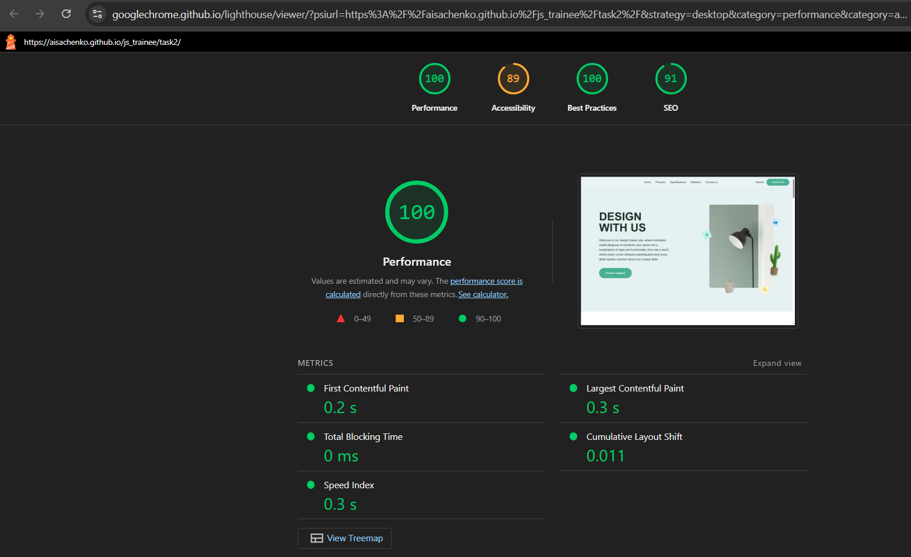
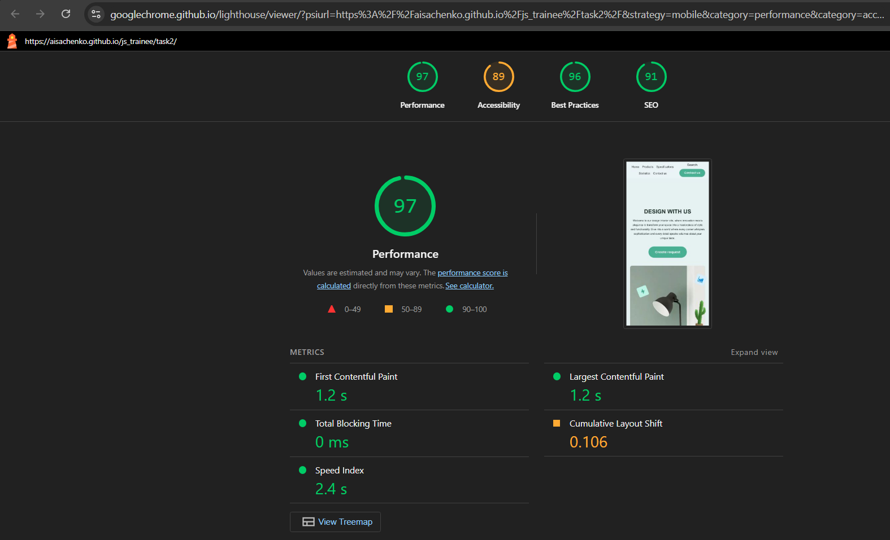
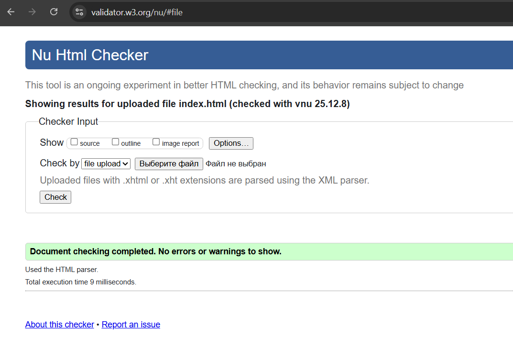
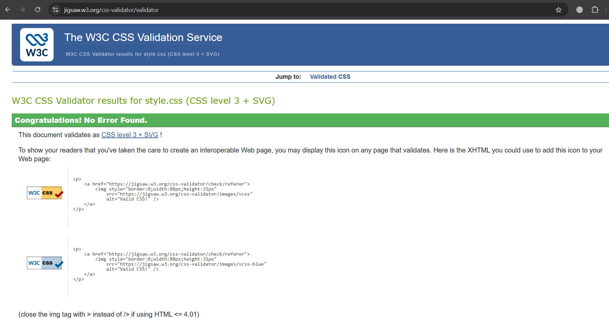

# Основы верстки и работы с инструментами

Закрепление базовых знаний frontend-разработки.

## Технологии
- HTML5
- CSS3 + LESS

## Как запустить локально
1.  Клонируйте репозиторий:
    ```bash
    git clone https://github.com/Aisachenko/js_trainee.git
    ```
2.  Перейдите в папку проекта:
    ```bash
    cd ваш-репозиторий
    ```
3.  Откройте файл `index.html` в браузере.

## Деплой
Проект размещен на GitHub Pages.
**[Посмотреть живую версию](https://aisachenko.github.io/js_trainee/task2/)**

## Результаты проверок
### Lighthouse



### Валидация HTML/CSS
* **HTML валидатор:**  
  
* **CSS валидатор:**  
  